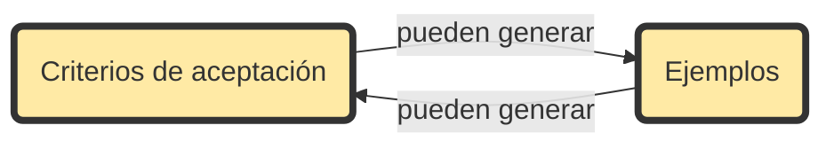

## Capitulo 1. Introducción a SBE y Gherkin.


#### 1.5.1 Derivar el alcance de los objetivos.
Los requisitos aparecen en el dominio del negocio.
Las soluciones aparecen en el dominio técnico.
#### 1.5.2 Ilustrar los requisitos con ejemplos.
#### 1.5.3 Especificar de forma colaborativa.
### 1.6 Beneficios a largo plazo de automatizar conversaciones.
#DEFINICIÓN    *Documentación viva -* documentación que cambia junto con el sistema que documenta gracias al enlace entre texto y código y a la validación frecuente.

### 1.7 Capturando conversaciones como especificaciones ejecutable

#DEFINICIÓN   *Escenario -* * un ejemplo concreto que ilustra una regla del negocio.

***Plantilla Given-When-then***
```
Dado un cliente que activa el seguimiento de ubicación movil.
	Cuando el cliente quiere planear una ruta
	Entonces el punto de inicio debería estar establecido como su ubicación actual.
```

#DEFINICIÓN   *Requisito de comportamiento -* Un requisito con forma de historia acerca de cómo los usuarios se comportan cuando interactuan con el sistema. Siempre se refieren a ejemplos de uso del sistema. 

**AVISO**     Si aparece alguna referencia sobre conexiones a base de datos o pulsar botones, se está haciendo mal.

#DEFINICIÓN   *Especificación ejecutable -* Una especificación que puede ser ejecutada como una prueba automatizada.


### 1.8 Haciendo software que importa

### 1.9 Resumen


# Parte 1. Escribiendo especificaciones ejecutables con ejemplos


## 2. La capa de especificación y la capa de automatización.
### 2.1 Las capas de especificaciones ejecutables.
Cada especificación ejecutable tiene dos capas:  *capa de especificación*  y  *capa de automatización*.

 ```mermaid
graph TD
A[Especificación ejecutable] --> B[Capa de especificación]
A --> C[Capa de automatización]
```
#### 2.1.1 Capa de especificación
#DEFINICIÓN    *Capa de especificación -* Contiene documentos de texto escritos en Gherkin que los humanos pueden leer.

**Elementos:**
	 - Criterios de aceptación.
	 - Escenarios.
	 - Lenguaje común.

Expresado todo en forma de escenarios *Given-When-Then*.

#DEFINICIÓN    *Suite de especificación -* Colección de especificaciones ejecutables y el código de prueba para un único proyecto. Suele colocarse en el código base ddonde pude ser automatizada y ejecutada.

#### 2.2.2 Capa de automatización
#DEFINICIÓN    *Capa de automatización -* ejecuta una simulación de la aplicación implementada para comprobar si el código se comporta según lo definido en la especificación.

Cada vez que quieres escribir una especificaciòn Gherkin debes añadir un nuevo fichero .feature a la capa de especificación de la *suite de especificación*, escribir los escenarios allí y entonces añadir el código de prueba a la suite.

**Gherkin** gestiona todo lo relativo a captura de convesaciones sobre la lógica del negocio, desde reescritura de los criterios de aceptación cómo escenarios hasta el modelado del dominio del negocio usando el lenguaje común. **Cucumber** permite al equipo de entrega probar el sistema usando los mismos ejemplos que se han capturado.

### 2.2 Escribir tu primer escenario Gherkin

#### 2.2.1 Feature (Funcionalidad)
*Feature* es la palabra que usa Gherkin para indicar que una nueva especificación ha comenzado. Puede ser sustituida por las palabras *Ability* o *Business Need* que permiten una mejor categorización.

Bajo la linea de *Feature*  se puede añadir una explicación de la funcionalidad.

#DEFINICIÓN    *Resumen de la especificación -* Linea de especificación conteniendo información importante para comprender la especificación.


#### 2.2.2 Scenario
Historias que describen como los usuarios interactuan con el sistema.

Debe seguir el patrón *Given-When-Then*:
		- Definir el contexto (*Given*s).
		- Describir un evento que ocurre en el sistema (*When*s).
		- Asegurarse que el resultado esperado tiene lugar (*Then*s)

Se permite incluir cualquier cantidad de información en formato libre entre la palabra reservada *Scenario* y el primer *Given* que ayude a aclarar cual es el propósito del escenario.

#### 2.2.3 Given (Dado que)
Responden a la pregunta ¿qué prerequisitos permiten que ocurra el escenario?
Proporcionan un contexto donde el escenario tiene lugar.

```Gherkin
Feature: Planificación

  Dado que la planificación es una funcionalidad muy grande, este fichero de especificación describe solo el escenario de alto nivel más importante
  Scenario: Creación de una reunión

    Given Mike, un miembro del equipo
```
[ Best practice ]--> se usa un ejemplo concreto, Mike y el rol que desempeña.


#### 2.2.4 When (Cuando)
Describen las acciones clave que realiza el usuario.
```Gherkin
Feature: Planificación

  Dado que la planificación es una funcionalidad muy grande, este fichero de especificación describe solo el escenario de alto nivel más importante
  
  Scenario: Creación de una reunión

    Given Mike, un miembro del equipo 
	When Mike elige 02.00pm cómo hora de comienzo de su reunión
```


#### 2.2.5 Then (Entonces)
Describe las consecuencias de la acción (When) en el contexto (Given). 
Normalmente son representaciones concretas de las reglas que quieren aplicarse.

```Gherkin
Feature: Planificación

  Dado que la planificación es una funcionalidad muy grande, este fichero de especificación describe solo el escenario de alto nivel más importante
  
  Scenario: Creación de una reunión

    Given Mike, un miembro del equipo 
	When Mike elige 02.00pm cómo hora de comienzo de su reunión
	Then he should be able to save his meeting
```


### 2.3 Comprensión de las estructuras de pasos y escenarios.
El paso de la capa de especificación a la de automatización.
#DEFINICIÓN    *Paso -*  la unidad más pequeña de la especificación Gherkin. Usualmente una única línea de código. Consiste en la *palabra reservada* seguida por el contenido en lenguaje natural.

Trabaja en dos niveles:
		- Describe la lógica del negocio en lenguaje natural.
		- Esta estrechamente relacionado con el código de pruebas subyacente.
Desde este punto de vista:
		- *Givens* ejecutan el código  necesario para crear el escenario de pruebas.
		- *Whens* ejecutan la acción principal del escenario que, se supone, cambiará el estado del sistema.
		- *Thens* miden o verifican las consecuencias de la acción realizada.

### 2.4 Probando diferentes salidas.
Para asegurar que la suite de especificación tiene una cobertura de escenarios aceptable, se debe especificar lo que ocurre tanto cuando cuando  un usuario realiza una aproximación exitosa cómo falla.


## Capitulo 3.  Dominando la plantilla *Given-When-Then*
Tres elementos de la escritura de escenarios:
+ *Estilo* acerca lo agradable del lenguaje.
+ *Composición* acerca de la claridad y coherencia.
+ *Historia* que es lo que se narra.

El ejemplo trabaja sobre un editor ficticio, *Queneau*, que permite imitira diferentes estilos

### 3.1 Elección del estilo correcto para los escenarios Gherkin.

#### 3.1.1 Desarrollo desde afuera hacia adentro *(outside-in)* en Gherkin

##### DEFINIR ACTORES EN LOS ESCENARIOS
Uso de nombres reales y escenarios orientados a la experiencia del usuario.
**Cada escenario  debe ser descrito desde la perspectiva de un *actor*.**

#DEFINICIÓN   *Actor -* Cualquier cosa que influya en una acción o proceso que tenga lugar en el sistema en diseño.

Tres tipos de actores:
	- *Interesados* : cualesquiera con intereses relacionados con el caso de uso. Puede ser interno, externo, evidente, oculto...
	- *Organizaciones:*  por ejemplo una organización externa que consuma servicios de la nuestra.
	- Sistemas.

##### DESARROLLO DE  AFUERA HACIA ADENTRO (Outside-in) Y ESCENARIOS ORIENTADOS A USUARIOS
Recomendado usar el punto de vista de los *usuarios finales*.

#TIP para obtener mejores requisitos es necesario comprender *quien* necesita una solución y *porqué* la necesita.

#DEFINICIÓN  *Outside-in development -* Metodología de desarrollo basada en comprender los objetivos  y motivos de los interesados. Termino asociado a Gherkin y BDD, no a SBE.

#### 3.1.2 Recoger datos realistas.
#### 3.1.3 Preferir la especificación de propósitos y resultados en vez de la interfaz de usuario.
#DEFINICIÓN  *End-to-end tests -* Tests que comprueban si el flujo de una aplicación se comporta conforme a lo esperado de principio a fin, emulando al usuario real interactuando con el UI.

#TIP  No escriba escenarios acerca del UI. Escribalos acerca de las salidas del negocio. A nadie le preocupa el UI más que dejar el trabajo hecho.

Estilo *orientado al interfaz* (conocido como *estilo imperativo*) contra estilo *orientado al resultado* (conocido como *estilo declarativo*). En el fondo son distintos niveles de abstracción.

### 3.2 Componer escenarios Gherkin.
Reglas de composición de la plantilla *Given-When-Then* para facilitar el desarrollo de afuera hacia adentro:
	- *Composición de bajo nivel -* Cómo formular los pasos de Gherkin.
	- *Composición de alto nivel -* Cómo equilibrar los *Givens*, *Whens* y *Thens* en un escenario.

#### 3.2.1 Empezar con un "Then".
#TIP  Empezar con los resultados anima a los usuarios aparticipar. Los resultados **existen** en el mundo real.

#TIP  Para conseguir mejores resultados, examinar comportamientos existentes y tratar de mejorarlos.

#DEFINICIÓN  *Miopía de marketing -* Error de poner más atención en el producto que en los beneficios producidos por el producto.

**Los *Thens* son los resultados.**

#TIP  Para facilitar el trabajo *outside-in* se puede usar el siguiente patrón en la mayor parte de los *Thens*:
				`<un actor> deberia ser capaz de <obtener un resultado>`.

**Definir correctamente los resultados es más importante que escribir buen Gherkin o buen software**

#### 3.2.2. Usar un unico "When" por escenario
Usar más de un *When* para un único resultado provoca que no podamos saber cual de esos *When* está produciendo los resultados.
Se debe pensar en los *Whens* cómo *tareas de usuario* realizadas por actores e intentar **especificar una única tarea por escenario**.

#DEFINICIÓN  *Tarea de usuario -* Instrucción de alto nivel que describe una única actividad de negocio.

#TIP  Para identificar tareas pensar si el usuario podría realizarla sin usar el ordenador. P.ej. Revisar contenido.

#TIP  Las tareas de usuario tiene lugar en el presente y deben ser expresadas en una oración activa.

> **Patrón Guíón**
> Aproximación centrada en el usuario para escribir **test de aceptación**. Organiza test alrededor de actores que realizan tareas de usuario para conseguir sus objetivos.

**Escenarios con multiples "Whens" aceptables"**.
Cuando una *tarea de usuario* se divide en múltiples *acciones de usuario*. P.Ej.- Una orden de impresión implica la selección de múltiples opciones de impresión.

#TIP  *[COMPOSICIÓN]*  Para distinguir entre *tareas* y *acciones* recordar que las tareas permiten a los actores llegar a los *Thens*.

#### 3.2.3 Especificar pre-requisitos con "Givens"
Un *Given* crea una *foto* del mundo representado y su historia *antes* de que la acción tenga lugar en el escenario.

#TIP  *[ESTILO]* Usar oraciones pasivas en preterito, o componer el *Given* cómo una **lista de cosas** que es necesario que ocurran antes de que los actores puedan realizar la acción. Imaginar los *Givens* cómo bloques de construcción.

##### REUSAR GIVENS EN LOS ANTECEDENTES (Background)
#DEFINICIÓN  *Antecedente (Background) -* Lista de pasos que se deben ejecutar antes de cada uno de los escenarios en el mismo fichero de funcionalidad.

#### 3.2.4 Elegir el nivel de abstracción correcto.
##### NO SER DEMASIADO ESPECÍFICO
##### ¿CUANTOS PASOS DEBE HABER EN UN ESCENARIO?
#TIP  mantener los escenarios en un nivel de abstracción tal que permita los mínimos *Givens*, *Whens* y *Thens*  sin sacrificar la legibilidad.

- Se debería explicar los detalles necesarios par acomprender el propósito del escenario. 
- Si un *flujo de usuario* debe ser parte de un escenario es ncesario que se mencione.
- Pensar en cómo lo pueden interpretar los lectores.
- **Ser más detallado cuando se introducen conceptos nuevos**. Si los usuarios leen las especificaciones de una forma lineal,  el conocimiento es acumulativo.
- Utilizar la *Prueba del pasillo*.

#DEFINICIÓN  *Prueba del pasillo (Corridor testing) -* Solucitud informal para obtener realimentación o datos rápidos del usuario.

### 3.3 Contar historias que impacten con Gherkin
El proposito es escribir escenarios significativos que cubran adecuadamente las pruebas.

#### 3.3.1 Escribir descripciones preparatorias.
Empezar escribiendo un texto libre y corto sobre el requisito. Ignorar distracciones y simplemente escribir *algo*.
La reescritura como patrón *Given-When-Then* se hará más adelante.
Si la descripción es satisfactoria se incluirá en el resumen de la especificación.

#### 3.3.2 Examinar  los criterios de aceptación con ejemplos.
Nuevos criterios de aceptación pueden dar lugar a nuevos ejemplos y viceversa.


Utilizar ejemplos para ilustrar los criterios de aceptación.

#### 3.3.3 Explorar contextos cuestionando los "Given".
Despues de escribir un escenario preguntarse *¿Hay algún contexto en el cual, para el mismo evento, se produzca un resultado diferente?*

#### 3.3.4 Explorar resultados cuestionando los "Then".
Preguntarse *¿Hay algún otro resultado significativo que no se haya contemplado?*

Cuando un mismo evento provoca dos resultados distintos (p.ej. prestar un servicio y realizar un cargo económico) se debe cuestionar si pueden darse por separado o no. Si pueden darse por separado, probablemente, se trata de dos requisitos distintos en dos dominios del negocio distintos.

## Capitulo 4. Bases de los Esquemas del escenario (scenario outlines)
#DEFINICIÓN  *Esquema del escenario (Scenario outline) -* Plantilla que escenarios similares pueden compartir para no tener que repetir el mismo escenario sólo cambiando las métricas.
Ayudan a implementar el principio **DRY** (*Don't Repeat Yourself*).
Esto implica realizar un *refinamiento de los ejemplos*:
- Mezclar ejemplos similares
- Eliminar ejemplos irrelevantes
- Enfocarse en los ejemplos clave.
- Asegurarse que los ejemplos clave son fáciles de entender.
 ### 4.1 Aplicación de ejemplo Shopping
 ### 4.2 Usar Esquemas del escenario.
 #### 4.2.1 Detectar redundancias en escenarios Gherkin
 #### 4.2.2 Refactorizar los escenarios redundantes con Esquemas del escenario
 Idealmente, hay dos tipos de escenarios:
- Los que agrupan visualment ejemplos similares y usan la misma plantilla subyacente para todos los ejemplos (*scenario outlines*).
- Los que son lo suficientemente importantes para permanecer independientes.

Ejemplo
```Gherkin
Given a <format> book in Simona's cart
When she pays for it
Then the book should be <shipped>
```

### 4.3 Estructura de un Esquema del escenario
```Gherkin
Feature: Shipping
	Scenario Outline: Shipping

		Given a <format> book in Simona's cart
			When she pays for it
			Then the book should be <shipped>

		Examples: 
		| format    | shipped                 |
		| PDF       | sent to a mobile device |
		| AudioBook | sent over email         |
		| Hardcover | shipped physically      |
		| Paperback | shipped physically      |
```
Se toman los *ejemplos simples* de los *escenarios simples* y se colocan en grupos refinados.
#### 4.3.1 La tabla de ejemplos
La primera línea es la cabecera conteniendo los parámetros del *Scenario Outline*.
Cada ejemplo viene en una fila.
#### 4.3.2 Parámetros
Vienen entre corchetes angulares (**<>**) y no admiten espacios.
La plantilla escenario se ejecuta una vez para cada fila de la tabla de ejemplos.

#### 4.3.3 La palabra reservada "Esquema del escenario" (Scenario outline).

### 4.4 Ventajas de los Esquemas del escenario.
#### 4.4.1 Ficheros de funcionalidad más cortos.
#### 4.4.2 Ficheros de funcionalidad organizados por reglas del negocio de alto nivel.

### 4.5 Crecer y mantener los Esquemas del escenario.
**Ninguna funcionalidad está escrita en piedra**.

