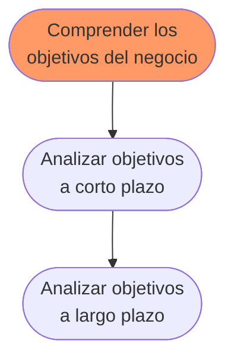
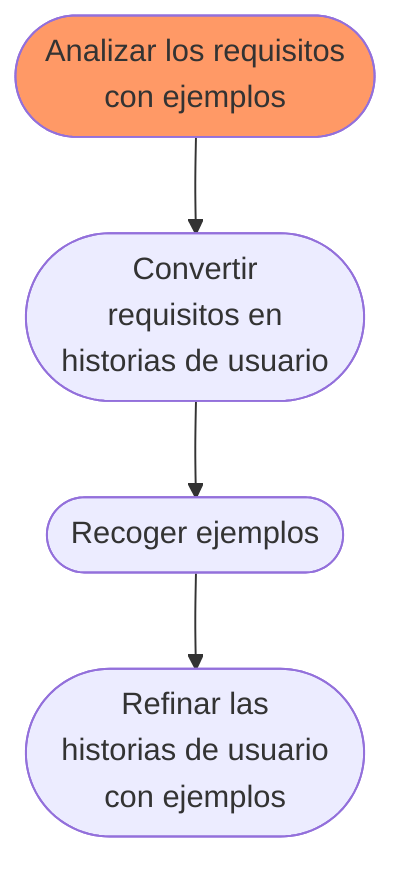

# Capitulo 6. El ciclo de vida de las especificaciones ejecutables
Dos tipos de *feedback*:
	- *Soporte:* confirman que se está trabajando en la dirección correcta.
	- *Crítica:* indican que se debe corregir el curso de la acción.

Nuestra área de interes recae en la mitad superior de la matriz.

SBE plantea la especificación como una actividad que se produce durante todas las fases del ciclo de vida del proyecto.

**Requisitos que evolucionan**  
El nivel de precisión de los requisitos cambiará a los largo del ciclo de vida de la especificación ejecutable. Cada requisito comienza como un vago objetivo de alto nivel con alto grado de incertidumbre. Conforme se implementa esta incertidumbre desaparece.

## 6.1 Visión general del proceso (end-to-end).
Las especificaciones en Gherkin se denominan *features*.

Cada especificación ejecutable deviene de un proceso de 5 pasos:

	1. Comprender los objetivos del negocio.
	2. Analizar el alcance de los requisitos a través de ejemplos.
	3. Diseñar la solución generando escenarios desde los critérios de aceptación y ejemplos.
	4. Refinar los escenarios hasta que se puedan implementar los comportamientos de la especifición.
	5. Iterar la especificación a lo largo del tiempo.

Los **objetivos de negocio** son directivas generales que no proporcionan una solución específica. Los **requisitos** son menos abstractos. Definen lo que se necesita hacer y por quién para coseguir el objetivo de alto nivel. Las **soluciones** son planes precisos para las funcionalidades, flujos de intereacción e interfaces de usuarios.

## 6.2 Comprendiendo los objetivos del negocio.

#TIP Elevar la discusión al nivel de objetivos de negocio permite trabajar con **alcance** y **prioridades** de una forma más eficiente.

**Otros recursos para la planificación estratégica**
Los **mapas de impacto** son visualizaciones del ambito y de las suposiciones subyacentes, creado en forma colaborativa.
Es un *mapa mental* que considera los siguientes cuatro aspectos:
	- *Objetivo -* ¿Porqué estamos haciendo esto?
	- *Actores -*  ¿Quien puede producir el efecto deseado? ¿Quien obstruirlo? ¿Quienes son los destinatarios del producto? ¿A quien afecta?
	- *Impactos -* ¿Cómo deberia cambiar el comportamiento de los actores? ¿Cómo pueden ayudar a conseguir el objetivo? ¿Cómo pueden oponerse? Pueden ser positivos o negativos.
	- *Entregables -*  ¿Qué podemos hacer para resistir/favorecer los impactos?

Se deben definir **métricas de éxito** para el objetivo y pensar que funcionalidades favoreceran los impactos positivos.
Estas funcionalidades se iran confirmando/descartando a lo largo del análisis y/o operación.

## 6.3 Analizar requisitos con ejemplos

### 6.3.1 Convertir los requisitos en Historias de usuario.
