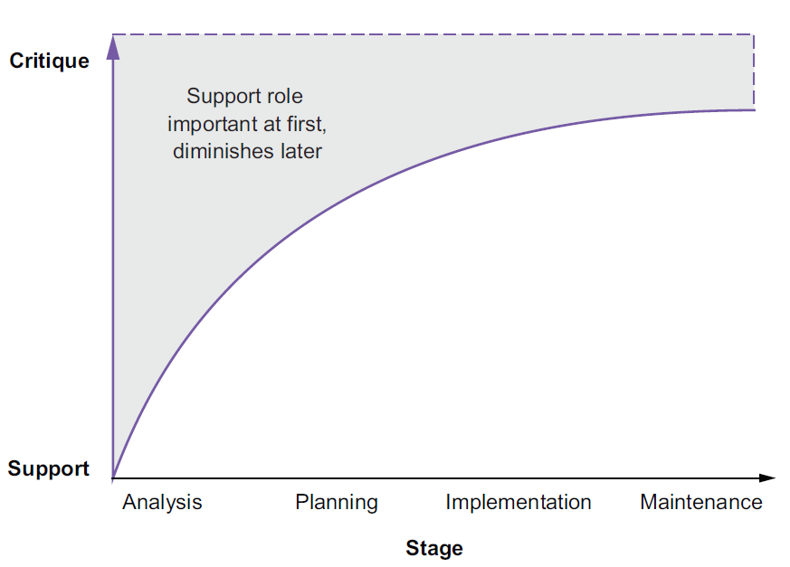
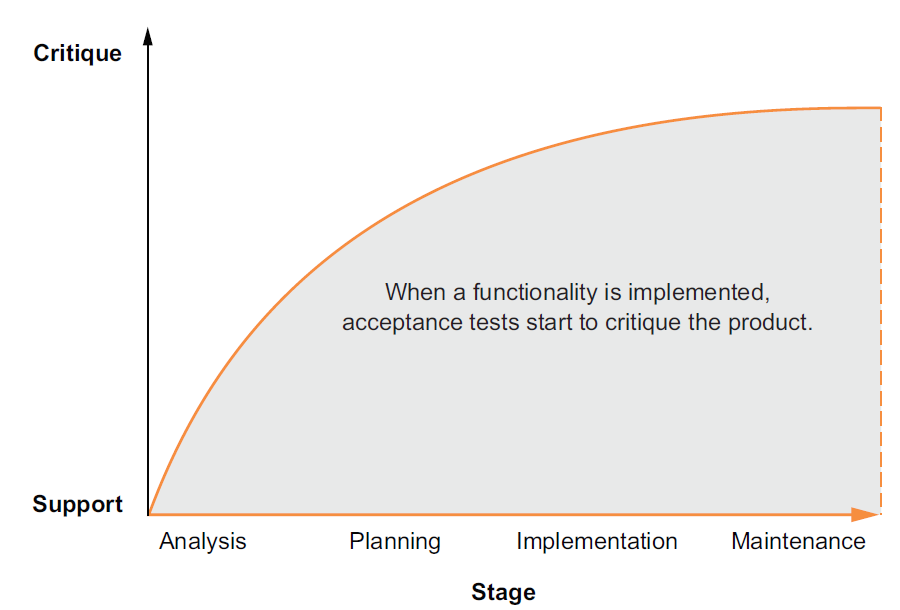
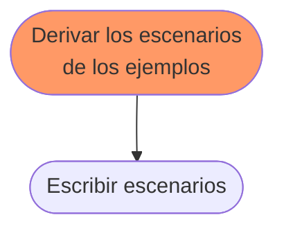
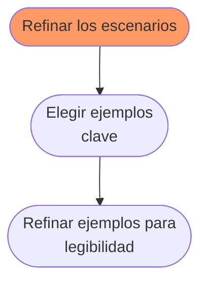
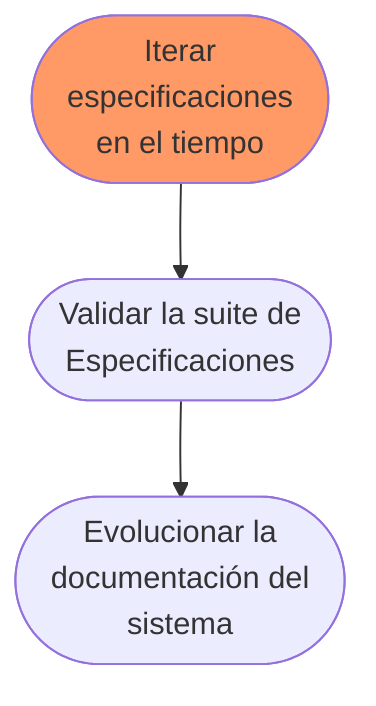

# Capitulo 6. El ciclo de vida de las especificaciones ejecutables
Dos tipos de *feedback*:
	- *Soporte:* confirman que se está trabajando en la dirección correcta.
	- *Crítica:* indican que se debe corregir el curso de la acción. 


Nuestra área de interes recae en la mitad superior de la matriz.

SBE plantea la especificación como una actividad que se produce durante todas las fases del ciclo de vida del proyecto.

<hr>
**Requisitos que evolucionan**  
El nivel de precisión de los requisitos cambiará a los largo del ciclo de vida de la especificación ejecutable. Cada requisito comienza como un vago objetivo de alto nivel con alto grado de incertidumbre. Conforme se implementa esta incertidumbre desaparece.
<hr>

## 6.1 Visión general del proceso (end-to-end).
Las especificaciones en Gherkin se denominan *features*.

Cada especificación ejecutable deviene de un proceso de 5 pasos:

	1. Comprender los objetivos del negocio.
	2. Analizar el alcance de los requisitos a través de ejemplos.
	3. Diseñar la solución generando escenarios desde los critérios de aceptación y ejemplos.
	4. Refinar los escenarios hasta que se puedan implementar los comportamientos de la especifición.
	5. Iterar la especificación a lo largo del tiempo.

Los **objetivos de negocio** son directivas generales que no proporcionan una solución específica. Los **requisitos** son menos abstractos. Definen lo que se necesita hacer y por quién para coseguir el objetivo de alto nivel. Las **soluciones** son planes precisos para las funcionalidades, flujos de intereacción e interfaces de usuarios.

## 6.2 Comprendiendo los objetivos del negocio.


#TIP Elevar la discusión al nivel de objetivos de negocio permite trabajar con **alcance** y **prioridades** de una forma más eficiente.

<hr>
**Otros recursos para la planificación estratégica**
Los **mapas de impacto** son visualizaciones del ambito y de las suposiciones subyacentes, creado en forma colaborativa.
Es un *mapa mental* que considera los siguientes cuatro aspectos:
	- *Objetivo -* ¿Porqué estamos haciendo esto?
	- *Actores -*  ¿Quien puede producir el efecto deseado? ¿Quien obstruirlo? ¿Quienes son los destinatarios del producto? ¿A quien afecta?
	- *Impactos -* ¿Cómo deberia cambiar el comportamiento de los actores? ¿Cómo pueden ayudar a conseguir el objetivo? ¿Cómo pueden oponerse? Pueden ser positivos o negativos.
	- *Entregables -*  ¿Qué podemos hacer para resistir/favorecer los impactos?


Se deben definir **métricas de éxito** para el objetivo y pensar que funcionalidades favoreceran los impactos positivos.
Estas funcionalidades se iran confirmando/descartando a lo largo del análisis y/o operación.
<hr>

## 6.3 Analizar requisitos con ejemplos


### 6.3.1 Convertir los requisitos en Historias de usuario.
Las historias de usuarios son *tickets para futuras conversaciones*. Usadas para determinar prioriades y alcance, para *Planificar*.

Ayudan a alinear los objetivos de negocio con los beneficios del usuario.

`Comparación de historias de usuario y especificaciones ejecutables`
|Historia de usuario|Especificación ejecutable|
|:--|:--|
|Descartada despues de implementar|Permanece despues de implementar|
|Unidad de cambio|Efecto del cambio|
|Tiene criterio de aceptación|Es un test de aceptación|
|Produce resultados a corto plazo <br> como tarjetas o tareas|Produce documentación viva a largo plazo

#TIP Los usuarios saben exactamente que es lo que quieren, pero no necesariamente como pueden conseguirlo. Solo cuando se ha decidido que solución será la mejor se debería empezar a escribir especificaciones ejecutables.

<hr>
**Almacenar historias de usuario en el Product Backlog**

Las historias de usuario son *tickets a futuro*.
No deberían reemplazar las conversaciones con los interesados, pero permiten prepararlas.
No deben tratarse como listas de tareas pendientes sino como *directrices* a explorar en el futuro.
Como recomendación, para cada historia puede registrarse los siguiente: 
-  *Interesados y sus interes -* Identificará los actores.
- *Disparador/es -* Ayudará a identificar los *Givens*.
- *Principal escenario de exito -*  Ayudará a identificar  los *Whens* y *Thens*.
- *Criterios de aceptacion -* Descripciones de dos a cinco lineas que describan las condiciones a ser verificadas.  Permitiran estimar el nº de escenarios y especificaciones ejecutable necesarias.
<hr>

### 6.3.2. Recoger ejemplos
#TIP Empezar preguntado las reglas esta bien, pero no hay que pensar que serán una lista completa de criterios de aceptación. Posiblemente seran confusas, contradictorias e incompletas.

Durante el periodo de analisis, se usan los ejempos para comprender el contexto del negocio y sus requisitos.



Las *crítica* significa la demanda de funcionalidad de los usuarios reales.  Nunca perderla de vista.

### 6.3.3 Refinar las historias de usuario con ejemplos.
A veces no es posible afrontar desarrollar todas las funcionalidades demandadas por los distintios tipos de cliente. En ese caso es mejor tomar las asociadas a un cliente modelo.

#DEFINICIÓN *Cliente modelo -* Un cliente con un comportamiento y necesidades lo más aproximados posibles al cliente médio, de forma que las decisiones tomadas sobre él sean extrapolables al mayor número de clientes.

#TIP No se debe separar las  *Funcionalidades* según la tecnología subyacente.

<hr>
**Obtener mejores requisitos con Inyección de Funcionalidades**
*Feature injection -* una técnica que deriva el alcance de la aplicción de los objetivos a través de ejemplos de alto nivel.
El equipo busca la creación de valor para el negocio enumerando las suposiciones asociadas.

La inyección de funcionalidades proporciona un conjunto de *caminos felíces* para crear los resultados que aportan valor al negocio. 


<hr>

## 6.4 Derivar escenarios de los ejemplos



De los ejemplos obtenidos se deriva una lista de criterios de aceptación para las historias de usuario.

`Ejemplo 1. Escenario correcto`
```Gherkin
Feature: New businesses
	Scenario Outline: Businesses should provide required data
		Given a restaurant <business> on <location>
			When <business> signs up to Mapper
			Then it should be added to the platform
				And its name should appear on the map at <location>
		Examples:
			| business | location |
			| Deep Lemon | 6750 South Street, Reno |
			| Matt's | 9593 Riverside Drive, St. Louis |
			| Back to Black | 8114 2nd Street, Stockton |
			| Green Pencil | 8583 Williams Street, Glendale |
			| Le Chef | 3318 Summit Avenue, Tampa |
			| Paris | 2105 Briarwood Court, Fresno |
			| Christie's | 714 Beechwood Drive, Boston |
			| The Monument | 77 Chapel Street, Pittsburgh |
			| Anchor | 110 Cambridge Road, Chicago |
```

`Ejemplo 2. Un escenario mejor`
```Gherkin
Feature: New businesses
	Scenario Outline: Businesses should provide required data
		Given a restaurant <business> on <location>
			When <business> signs up to Mapper
			Then it should be added to the platform
				And its name should appear on the map at <location>
		Examples:
		| business | location |
		| Deep Lemon | 6750 Street South, Reno |
		| Deep Lemon | 289 Laurel Drive, Reno |
		| Matt's | 9593 Riverside Drive, St. Louis |
		| Back to Black | 8114 2nd Street, Stockton |
		| Green Pencil | 8583 Williams Street, Glendale |
		| Le Chef | 3318 Summit Avenue, Tampa |
		| Paris | 2105 Briarwood Court, Fresno |
		| Christie's | 714 Beechwood Drive, Boston |
		| The Monument | 77 Chapel Street, Pittsburgh |
		| Anchor | 110 Cambridge Road, Chicago |
```
SBE introduce el ejemplo donde un mismo negocio tiene varias localizaciones.

#TIP Como regla general, el buen código no necesita test complejos.

## 6.5 Refinar los escenarios



Además del *camino feliz* deben incorporarse contrajemplos que nos desvien del camino feliz.

`Ejemplo 3. La mejor especificación con ejemplos clave refinados`
```Gherkin
Feature: New businesses
	

	Scenario Outline: Businesses should provide required data
		Given a restaurant <business> on <location>
			When <business> signs up to Mapper
			Then it <should?> be added to the platform
				And its name <should?> appear on the map at <location>
		Examples: Business name and location should be required
			| business | location | should? |
			| UNNAMED BUSINESS | NOWHERE | shouldn't |
		Examples: Allow only businesses with correct names
			| business | location | should? |
			| Back to Black | 8114 2nd Street, Stockton | should |
			| UNNAMED BUSINESS | 8114 2nd Street, Stockton | shouldn't |
		Examples: Allow businesses with two or more establishments
			| business | location | should? |
			| Deep Lemon | 6750 Street South, Reno | should |
			| Deep Lemon | 289 Laurel Drive, Reno | should |
		Examples: Allow only suitable locations
			| business | location | should? |
			| Anchor | 110 Cambridge Road, Chicago | should |
			| Anchor | Chicago River, Chicago | shouldn't |
			| Anchor | NOWHERE | shouldn't |
		
```

#TIP El uso de mayusculas en el escenario anterior para los ejemplos problemáticos es, exclusivamente, para mejorar la legibilidad.

## 6.6 Iterar especificaciones en el tiempo.
El equipo deberá validar la especificación frecuentemente para detectar errores de integración.


### 6.6.1 Validar la suite de especificación.
Puede darse el  caso que se haya dejado de especificar algún criterio de aceptación.
En este punto debemos: 
	- añadir escenarios adicionales a la feature o refactorizar los existentes.
	- Implementar el código de pruebas.
	- Ejecutar las pruebas unitarias y de integración.

Esto podrá provocar el fallo de otras pruebas y su escenarios asociados.

Finalmente se realizaran las *pruebas de aceptación de los usuarios (UAT)*.

#DEFINICIÓN *Pruebas de aceptación de usuario (UAT) -* Ultima fase del proceso de prueba del software. 

### 6.6.2. Hacer evolucionar el sistema de documentación.
Para prevenir conocimiento implicito que se perderá con el tiempo o la salida de miembros del equipo se deben introducir comentarios aclaratorios cada vez que se modifica una feature.

Es el último paso del *ciclo de vida de la especificación*.

`Ejemplo. Especificación ejecutable con aclaraciones`
```Gherkin
Feature: New businesses
	Scenario Outline: Businesses should provide required data
	[...]
	
	Scenario Outline: Businesses should be able to set relevant hours
			BUSINESS HOURS define when a business opens and closes.
			Businesses provide POPULAR HOURS to help their customers
			decide when it's the best time to come in.
		
		Given a restaurant <business> on <location>
			When it schedules <hours> to be <times>
			Then the <hours> should appear on the map at <location>
		
		Examples: Restaurants
			| business | location | hours | times |
			| Deep Lemon | 6750 Street South, Reno | business hours | 7 AM-8 PM |
			| Deep Lemon | 6750 Street South, Reno | popular hours | 3 PM-5 PM |
		Examples: Bistros
			| business | location | hours | times |
			| Le Chef | 3318 Summit Avenue, Tampa | business hours | 9 AM-9 PM |
			| Le Chef | 3318 Summit Avenue, Tampa | popular hours | 8 PM-9 PM |
		Examples: Pubs
			| business | location | hours | times |
			| Anchor | 77 Chapel Road, Chicago | business hours | 3 PM-3 AM |
			| Anchor | 77 Chapel Road, Chicago | popular hours | 9 PM-2 AM |
```

## 6.7 Resumen
- Una especificación ejecutable evoluciona a traves del ciclo de vida del proyecto.
- Conforme progresa el proyecto, las especificaciones son más precisa.
- Explorar ejemplos es un proceso de descubrimiento.
- Los ejemplos claves deberian ilustrar los criterios de aceptación clara y completamente.
- Las nuevas funcionalidades añaden nuevos documentos de especificación a la suite pero también se ven influenciadas por las especificaciones existentes previamente.
