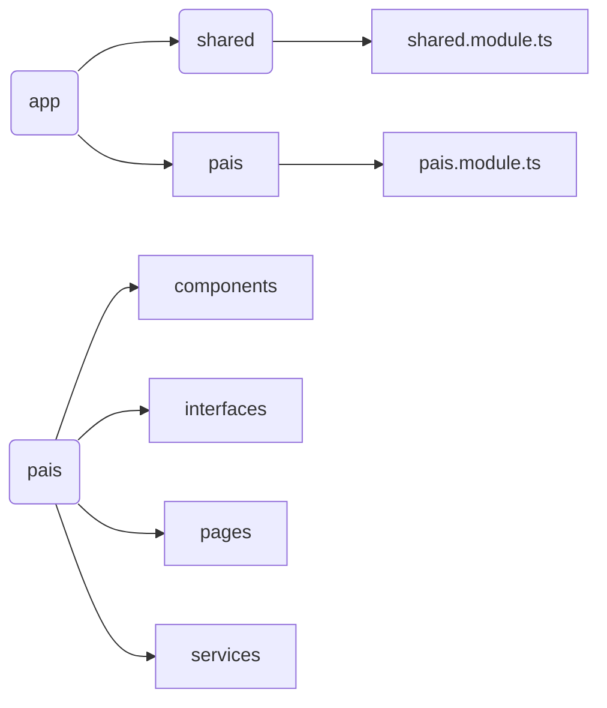

## 97. Inicio de proyecto - PaisesApp
	 > ng new PaisesApp
## 98. Estructura



+ modulo **shared** almacenará los elementos reutilizables.
+ modulo **pais** contendrá los elementos de la app.

## 99. Creación de módulos y componentes

### Genera módulos
Los módulos ***pais.module.ts*** y ***shared.module.ts*** contendrán las declaraciones de importación y exportación generales a los elementos de las carpetas del mismo nombre y se generan con *Angular CLI*.

	ng generate module shared
Al hacerlo así, *Angular CLI* los crea directamente dentro de las carpetas asociadas.

### Generar componentes

	ng generate component shared/sidebar --skip-tests --is
Generará un componente dentro de la carpeta indicada
 * ***--skip-tests*** indica que no se generaran archivos de tests para este componente.
 * ***--inline-style*** indica que no se generarán archivos de estilo para este componente.
	
### Exportar componentes
Para poder usar los componentes en otros elementos debemos exportarlos en el módulo al cual pertenecen

**shared.module.ts**
```typescript
@NgModule({
  declarations: [
    SidebarComponent
  ],
  exports: [
    SidebarComponent],
```

### Importar componentes
Para que los componentes de un módulo puedan usar otros componentes deben ser importados en la declaración de este módulo.

**app.module.ts**
```typescript
@NgModule({
  declarations: [
    AppComponent
  ],
  imports: [
    BrowserModule,
    PaisModule,
    SharedModule
  ],
```

### Estructura HTML
Se editan los ficheros.html de los componentes.
Utiliza **BootStrap** para el formateo de documentos.

## 101. RouterModule. Añadir rutas a la aplicación.


## 106. Servicio para buscar países.

Se genera un servicio que será inyectado en el componente que lo consume. 
+ Generar un servicio
```bash 
ng generate service pais/services/pais --skip-tests
```
El servicio no necesita ser importado porque es un elemento inyectable que hacemos visible a toda la aplicación  y se comporta cómo un singleton.
```javascript
@Injectable({
	providedIn: 'root'
})
```

* Cargar el modulo Cliente de http.

```app.module.ts```

```javascript
import { HttpClientModule } from '@angular/common/http';
```
- Inyectar el cliente http en el servicio
```pais.service.ts```
```javascript
constructor (private http: HttpClient){}
...
http.get(url);
```
- Inyectar el servicio en el componente que lo va a a consumir 

```pais.component.ts```
```javascript
constructor(private paisService: PaisService) { }
```
- Consumir el servicio rest
```javascript
this.paisService.buscarPais(this.termino)
.suscribe(resp => {...}
```

Para compartir datos entre la parte *html* y la parte *typescript* del componente se vinculan a través de *[(NgModel)*.

## 107. Manejo de errores
** *ngIf =<condicion>** en la parte *html* del componente.
```html
<div *ngIf="hayError">
	No se encontró el termino {{termino}}
</div>
```

Otra forma es tratar el error en la parte *typescript* del componente, por ejemplo:
```typescript
this.http.get(url)
            .pipe(
              catchError ( err => of([]))
            );
```

## Tipado de la petición de RestCountries


## 122. NgClass, class y [class.]
Se trata de introducir condiciones a las clases css.
```javascript
class = "btn btn-outline-primary"

[class.btn-primary] = "region === regionActiva"

[ngClass]="{
    'btn-primary': regionActiva===region,
    'btn-outline-primary':regionActiva !== region
}" 
```

## 123. Clases de CSS condicionales
```html
[class]="getClaseCSS(region)"
```

```javascript
  getClaseCSS(region:string): string{
    return (region === this.regionActiva) ? 'btn btn-primary': 'btn btn-outline-primary'
  }
```


## 126.Optimizar las peticiones HTTP
El API de *restCountries.com* permite determinar qué campos se quieren obtener, lo que ayuda a optimizar el tamaño de las consultas.

Utiliza un objeto del tipo **HttpParams** para indicarle los campos a retornar.
```javascript
const httpParams = new HttpParams()
    .set('fields', 'name,capital,alpha2code,flag,population');
...
  return this.http.get<Country[]>(url, { params: this.httpParams})
```

## 127. Animaciones de CSS
Usa la librería *https://animate.style*

## 128. Mostrar sugerencias al escribir. Autocomplete


