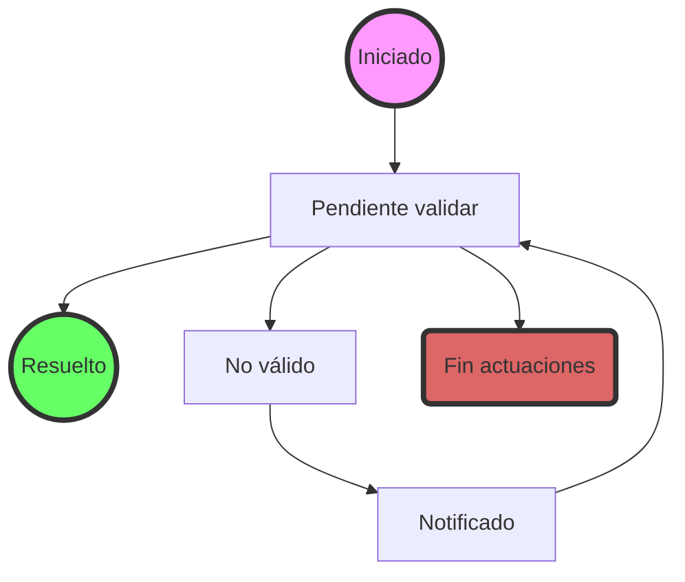

# RIA. Propuesta tramitación solicitudes.
La aplicación RIA (Registro de Industrias Agrarias) viene determinada por las siguientes premisas:

## 1. Premisas
* Cada solicitud  de creación/modificación/borrado de un **establecimiento** está asociada a un **expediente** de forma única.
* Mientras el expediente no alcance una situación definitiva (*estado final*) podrá ser modificado con datos aportados en la  solicitud presentada. Esta situación del expediente se define como **borrador**.
* Las deficiencias detectadas en el expediente se comunicarán al usuario mediante **notificación** matieniendose cómo *borrador*. El expediente pasará a considerarse como en **trámite de audiencia**.
* El solicitante podrá resolver las deficiencias de la solicitud de registro mediante la presentación de una **solicitud de subsanación**  que pasará a incorporarse al expediente actual.  Esto provocará que la solicitud vuelva a *validarse* teniendo en cuenta la nueva documentación aportada.
* 
### 1.1. Expedientes resueltos.
* Una vez determinado que la solicitud es correcta, el expediente se considerará **resuelto**.
* Un expediente *resuelto* no podrá ser modificado, siendo necesario, para ello, iniciar un nuevo expediente.
*   Los datos asociados a un expediente *resuelto* se consideran cómo **áctivos/actuales**, se persistirán en el sistema y serán los que se visualicen en las consultas de situación del establecimiento.
* 
### 1.2 Expedientes en fin de actuaciones
* Si finalizado el periodo de *trámite de audiencia* no se hubieran resuelto las deficiencias de la solicitud, el expediente pasará a la situación de **fin de Actuaciones** entendiendosé como *activos* los datos asociados al último expediente que hubiera alcanzado la calificación de *resuelto*.
* Un expediente en *fin de actuaciones* no puede ser modificado, siendo necesario, para ello,  iniciar un nuevo expediente.
* Los datos asociados a un expediente en *fin de actuaciones* no se persistirán ni aparecerán en las consultas de situación del establecimiento.
* 
### 1.3 Renuncias
* El solicitante del registro podrá presentar la **renuncia** al procesamiento de su solicitud antes de que el expediente asociado haya sido categorizado cómo **resuelto** quedando ésta en *fin de actuaciones* y no siendo persistido en el sistema.

## 2. Circuito de tramitación.
### 2.1 Trámites identificados
|ESTADO|DESCRIPCION|DETALLE|FINAL|
|:--:|:--|:--|:--:|
|1|Iniciado|El solicitante ha presentado su solicitud y se ha creado el expediente y se han escrito todo o parte de los datos asociados.|N|
|2|Pendiente Validación|El funcionario responsable determina que los datos grabados corresponden a la solicitud presentada y el expediente es procesable.|N|
|3|**Resuelto**|**Se determina que la solicitud es correcta y formalmente válida y que se han registrado todos los datos presentados**.|**S**|
|4|No válido|La solicitud es incompleta, erronea o formalmente incorrecta. El expediente no puede ser procesado. Se debe notificar al solicitante.|N|
|5|Notificado|Se ha enviado una notificación al solicitante de que debe subsanar los problemas detectados.|N|
|6|**Fin de actuaciones**|**El solicitante no ha respondido en plazo a la petición de subsanación, lo ha hecho de forma errónea o ha presentado su renuncia**.|**S**|

### 2.2 Circuito de tramitación

	
***Nota:*** Se han omitido algunos estados intermédios cómo *válido* o *trámite de audiencia* en aras de minimizar el nº de estados posibles. El criterio para eliminar un estado ha sido determinar si tenía una única entrada y una única salida  y esta apuntaba a un estado final.

